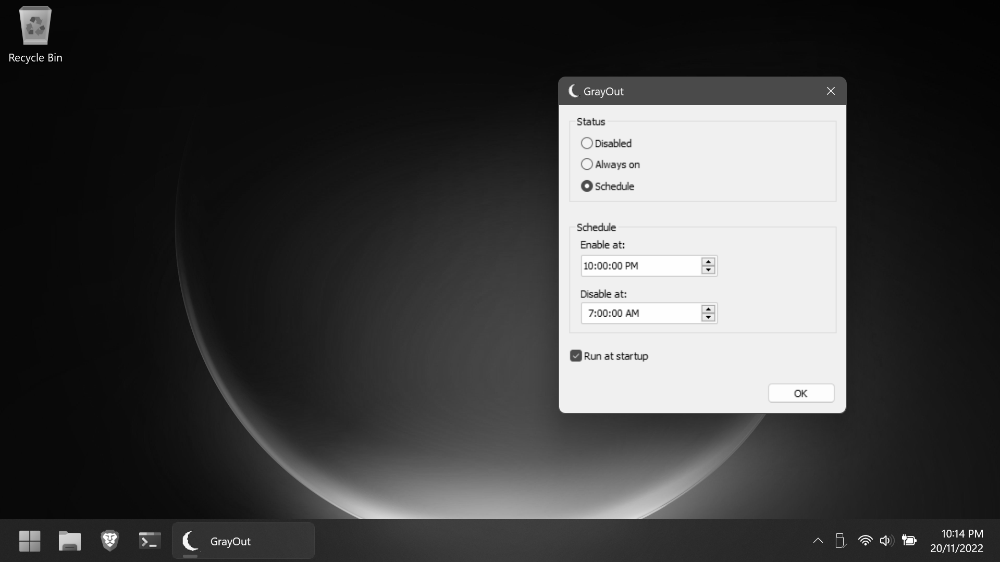

# GrayOut

GrayOut allows users to schedule times for the Windows UI to switch to grayscale.

Setting our devices to grayscale is proven to [reduce their stimulation and visual appeal](https://www.nytimes.com/2018/01/12/technology/grayscale-phone.html). Running GrayOut on a schedule provides a helpful cue that it's time to sleep.

## Installation

Simply [download the EXE from the Releases page](https://github.com/Scienciser/GrayOut/releases) (Windows 7 and later), move it to a suitable folder and run it. No administrator privileges are required.

Closing the app will minimize it to the taskbar. To exit, right-click the GrayOut taskbar icon and select 'Exit'.
